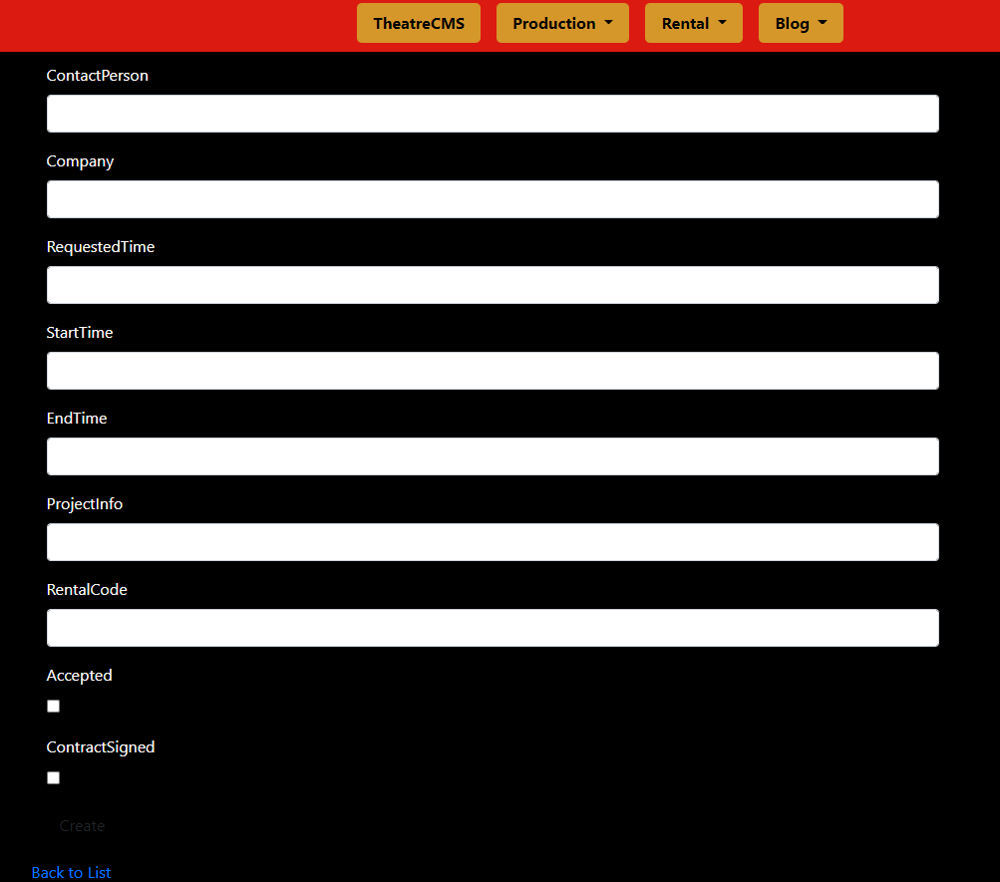
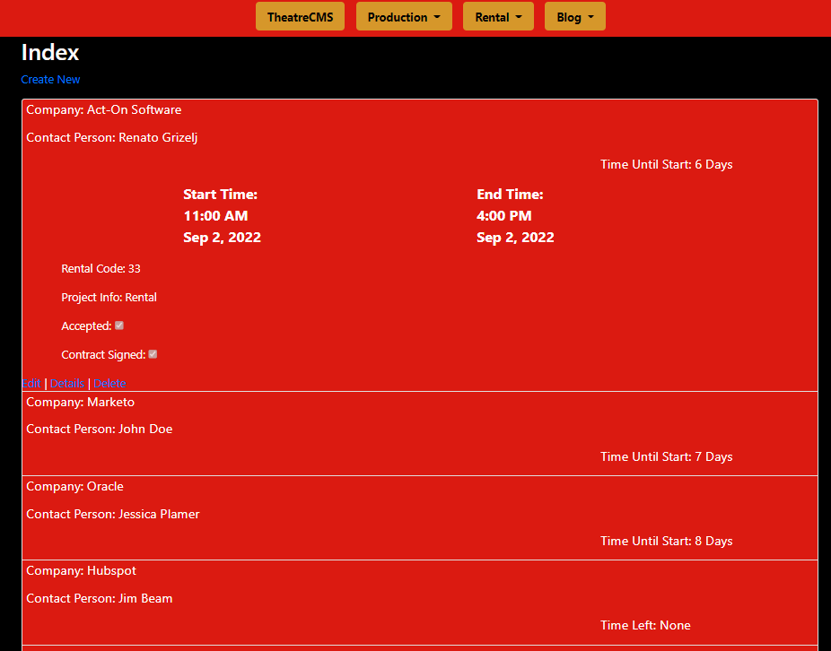

# Live Project

## Introduction

The last two weeks of my time spent at [The Tech Academy][ta], I participated in a team project centered on building out a web application for a performing arts theater in Portland, OR.  We worked in ASP.NET MVC C# with a code first Entity Framework Database.  During the two-week sprint the team communicated via Discord and the project management was facilitated through Azure DevOps. I worked on both front-end and back-end tasks for the project. I learned a lot about the MVC pattern and using it to build out a functioning web application. 

## Overview

### About Page
I used HTML and CSS to create an "About Us" page that included the theater's mission statement, ensemble, company history, and BOD.


### Rental Request Model
I created an entity model for Rental Requests so that they could be saved to the database.  Afterward, I scaffolded the CRUD pages for this model.

Here is the 'Create' View for the Rental Request model:


### Rental Request View Enhancements
The rental requests were displayed in a table on the scaffolded index page.  I changed this to an accordion view, whereby clicking on the horizontal bar associated to a requester would reveal a pane containing additional details about the rental request.

In addition , I used C# to display the "Time Unitl Start/ Time Left" fpr the rental.


#### Code
```
@model IEnumerable<TheatreCMS3.Areas.Rent.Models.RentalRequest>

@{
    ViewBag.Title = "Index";
    Layout = "~/Views/Shared/_Layout.cshtml";
}

<h2 class="RentalRequest-index--title">Index</h2>

<p>
    @Html.ActionLink("Create New", "Create")
</p>


<div>
    <div class="accordion" id="accordionExample">
        @foreach (var item in Model)
        {
            DateTime currentDate = DateTime.Now;

            string startTimeString = Html.DisplayFor(modelItem => item.StartTime).ToString();
            DateTime startTime = Convert.ToDateTime(startTimeString);
            TimeSpan diff = startTime.Subtract(currentDate);

            string endTimeString = Html.DisplayFor(modelItem => item.EndTime).ToString();
            DateTime endTime = Convert.ToDateTime(endTimeString);
            TimeSpan remainingDiff = endTime.Subtract(currentDate);

            if (endTime.AddDays(7) > currentDate)
            {
                <div class="rent-index--current card">
                    <div class="RentalRequest-index--card-header" id="headingOne">
                        <h5 class="mb-0">
                            <button class="RentalRequest-index--cardBtn" type="button" data-toggle="collapse" data-target="#info-@item.RentalRequestId" aria-expanded="true" aria-controls="collapseOne">
                                <div class="RentalRequest-index--headBox">
                                    <div class="rent-index--headDiv">
                                        <p class="rent-index--company">Company: @Html.DisplayFor(modelItem => item.Company)</p>
                                        <p class="rent-index--contact">Contact Person: @Html.DisplayFor(modelItem => item.ContactPerson)</p>
                                    </div>
                                    @if (diff.Days >= 1)
                                    {
                                        <p class="RentalRequest-index--timeUntil">Time Until Start: @diff.Days Days</p>
                                    }
                                    else if (diff.Days < 1 && diff.Hours >= 1)
                                    {
                                        <p class="RentalRequest-index--timeUntil">Time Until Start: @diff.Hours Hours</p>
                                    }
                                    else if (diff.Days < 1 && diff.Hours < 1 && diff.Minutes >= 1)
                                    {
                                        <p class="RentalRequest-index--timeUntil">Time Until Start: @diff.Minutes Minutes</p>
                                    }
                                    else if (remainingDiff.Days >= 1)
                                    {
                                        <p class="RentalRequest-index--timeUntil">Time Left: @remainingDiff.Days Days</p>
                                    }
                                    else if (remainingDiff.Days < 1 && remainingDiff.Hours >= 1)
                                    {
                                        <p class="RentalRequest-index--timeUntil">Time Left: @remainingDiff.Hours Hours</p>
                                    }
                                    else if (remainingDiff.Days < 1 && remainingDiff.Hours < 1 && remainingDiff.Minutes >= 1)
                                    {
                                        <p class="rent-index--timeUntil">Time Left: @remainingDiff.Minutes Minutes</p>
                                    }
                                    else if (remainingDiff.Days < 1 && remainingDiff.Hours < 1 && remainingDiff.Minutes < 1 && endTime.AddDays(7) > currentDate)
                                    {
                                        <p class="RentalRequest-index--timeUntil">Time Left: None</p>
                                    }
                                </div>
                            </button>
                        </h5>
                    </div>

                    <div id="info-@item.RentalRequestId" class="collapse" aria-labelledby="headingOne" data-parent="#accordionExample">
                        <div class="RentalRequest-index--card-body">
                            <div class="RentalRequest-index--timeBox">
                                <p class="RentalRequest-index--startTime">Start Time:<br /> <span class="rent-index--dateTime">@startTime.ToShortTimeString() <br /> @startTime.ToString("MMM") @startTime.Day, @startTime.Year</span></p>
                                <p class="RentalRequest-index--endTime">End Time:<br /> <span class="rent-index--dateTime">@endTime.ToShortTimeString() <br /> @endTime.ToString("MMM") @endTime.Day, @endTime.Year</span></p>
                            </div>
                            <div class="RentalRequest-index--infoBox">
                                <p class="RentalRequest-index--info">Rental Code: @Html.DisplayFor(modelItem => item.RentalCode)</p>
                                <p class="RentalRequest-index--info">Project Info: @Html.DisplayFor(modelItem => item.ProjectInfo)</p>
                                <p class="RentalRequest-index--info">Accepted: @Html.DisplayFor(modelItem => item.Accepted)</p>
                                <p class="RentalRequest-index--info">Contract Signed: @Html.DisplayFor(modelItem => item.ContractSigned)</p>

                                @Html.ActionLink("Edit", "Edit", new { id = item.RentalRequestId }) |
                                @Html.ActionLink("Details", "Details", new { id = item.RentalRequestId }) |
                                @Html.ActionLink("Delete", "Delete", new { id = item.RentalRequestId })
                            </div>
                        </div>
                    </div>
                </div>
            }          
        }
    </div>
</div>
```
[ta]: <https://www.learncodinganywhere.com/>